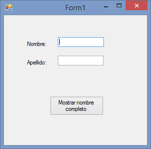
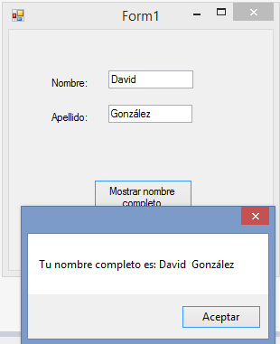
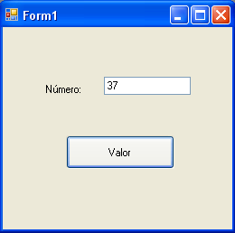
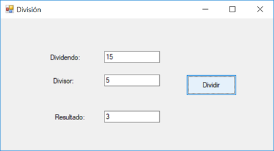
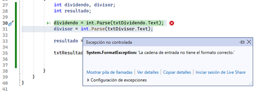
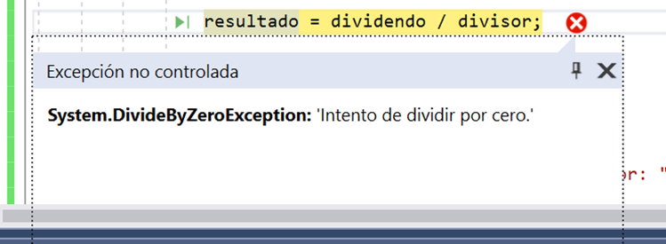

                                     

<br>
<br>

# Tema 2. Elementos del lenguaje

[*1.	Introducción a los tipos de datos básicos*](#_apartado1)

[*2.	Constantes y Variables*](#_apartado2)

[*3.	Operaciones Primitivas*](#_apartado3)

[*4.	Expresiones y Sentencias en C#*](#_apartado4)

[*5.	Cadenas interpoladas*](#_apartado5)

[*6.	Manejo de Errores de Ejecución. Try - Catch*](#_apartado6)

[*7.	Introducción al Trabajo con la Consola en C#*](#_apartado7)

<br>
<br>

# <a name="_apartado1"></a>1. Introducción a los tipos de datos básicos.

El **tipo de datos** de un elemento de programación hace referencia a la clase de datos que puede contener y a cómo se almacenan los datos. El sistema de tipos comunes (Common Type System – CTS) define los tipos de datos que soporta el Common Language Runtime. 

**C# .NET** utiliza tipos de datos que se corresponden directamente con los tipos de datos del sistema de tipos comunes.

El sistema de tipos comunes tiene una gran importancia en la creación de aplicaciones para la plataforma Microsoft .NET. Hace posible que un desarrollador pueda crear un proyecto en Visual Basic .NET e integrarlo con un componente creado por otro desarrollador en Microsoft C# y una función escrita por un tercer desarrollador en otro lenguaje compatible con .NET. 

### Tipos de datos en C#

- **Enteros**: El tipo de datos entero define a los números enteros positivos y negativos. Se representan en C# mediante el tipo de datos **int**. 
  
- **Reales**: Representa el conjunto de los números reales o decimales.  
   Las palabras reservadas para definir un número real son:  
      **float**: número real de 32 bits.  
      **double**: número real de 64 bits.

- **Decimal:** Números decimales con alta precisión en base 10 (128 bits), ideal en finanzas. Sufijo m (ej: 19.95m).
  
- **Lógico o booleano**: Es un tipo especial de datos, muy utilizado en programación y que solamente puede tomar el valor cierto o falso.  
  Se definen con la palabra reservada **bool**, y solo pueden tomar el valor **true** o **false**.

- **Carácter**: Un dato de tipo carácter contiene un solo carácter Unicode.  
  Se definen con la palabra reservada char y representa a los caracteres contenidos en el código Unicode. 

- **Cadena de caracteres o string:** Se definen con la palabra reservada **string**, y se representan entre comillas dobles.  
   Un ejemplo de valor de tipo string podría ser el nombre de una persona: “David González”

- **Enumerado (enum):** Conjunto de constantes identificadas con nombre, basadas en enteros.
  Ejemplo: 
  ```
  enum Estacion { Primavera, Verano, Otoño, Invierno};
  ```

### Ejemplo. ¿Qué tipos de datos se podrían utilizar para los siguientes conceptos?:

- **Edad**: Entero, int.
  
- **Código Postal**: Cadena de caracteres o string (Es un número no operable: 03005)
  
- **D.N.I**.: Cadena de caracteres o string
  
- **Altura**: Entero (int) o Real (double, float o decimal según la precisión).
  
- **Sexo**: Carácter (char)
  
- **¿Casado?**: Lógico(bool) 
  
- **I.V.A. a aplicar**: Numérico Real (double) o Entero (int).
  
- **Tipo de transporte (Coche, Tren, Avión, Barco)**: Enumerado (enum).

<br>
<br>

# <a name="_apartado2"></a>2. Constantes y Variables

Cualquier programa informático necesita almacenar y tratar información. Para ello se utilizan constantes y variables. 

- **Constantes** → Son datos que mantienen el mismo valor a lo largo de toda la ejecución del programa.  
  
- **Variables** → Permiten almacenar datos cuyo valor puede cambiar durante la ejecución del programa.  
  
Tanto las constantes como las variables tienen una serie de atributos:

- **Nombre o identificador** → Sirve para identificar y referenciar la variable o constante en el programa.  
  
   - Debe describir con claridad la información que almacena.  
   - Reglas en C#:  
      - Formados por letras (alfabeto inglés), dígitos y guion bajo `_`.  
      - El primer carácter debe ser una letra.  
      - No pueden contener espacios ni símbolos.  
      - No pueden usar palabras clave reservadas como `int`, `for` o `Date`.  
  
   -	Ejemplos válidos: **num**, **nombre**, **apellidos**, **PI**, **empresa1**, **costeInicial**, **unidad1Apartado2**.  
   Nota: aunque C# permite usar identificadores Unicode (acentos, ñ…), no es recomendable por compatibilidad.
   - Convenciones de estilo → Siguiendo la guía de Microsoft:
     - Variables locales y parámetros → `camelCase`.  
     - Ejemplos: `numero`, `numeroEntero`, `numeroReal`.  
     - Constantes y propiedades → `PascalCase`.  
     - Ejemplos: `Max`, `NumIntentos`, `CosteInicial`.  
  
- **Valor** → Es el dato almacenado. En las constantes no cambia nunca; en las variables puede variar durante la ejecución.  
  
- **Tipo de datos** → Determina el conjunto de valores que puede tomar y las operaciones que se pueden realizar.  
  
En el apartado anterior vimos los tipos básicos en C#, además, C# permite definir tipos de datos enumerados (`enum`), que son conjuntos de constantes con nombre.

Por ejemplo, para representar las estaciones del año podemos definir:  

`enum Estacion { Primavera, Verano, Otoño, Invierno }`

De esta forma, una variable de tipo `Estacion` solo podrá tomar uno de esos valores, evitando errores y haciendo el código más legible.

## VARIABLES

Vamos a introducir brevemente la forma de declarar variables y explicaremos algunos conceptos. En temas posteriores se irán ampliando estos conceptos sobre variables.

**Declaramos** una variable para especificar su nombre y sus características, indicando de qué tipo es la misma.

La sintaxis para declarar una variable será la siguiente:

`tipo nombre;`

**Ejemplo de declaración de variables:**

```csharp
int num;
int i, j, k;
int multiplicando, multiplicador, resultado;
float numReal;
double numDoblePrecision1, numDoblePrecision2;
string nombre;
enum Estacion { Primavera, Verano, Otono, Invierno }
Estacion estacionActual;
```

En este pequeño ejemplo de declaración de variables vemos que primero se declara una variable llamada num de tipo entero, a continuación, tres variables `i, j, k` de tipo entero (útiles en bucles), después otras tres variables enteras más descriptivas: `multiplicando`, `multiplicador` y `resultado`. Seguimos con un número real de precisión simple (`float`), dos de doble precisión (`double`), un número decimal de alta precisión (`decimal`, recomendado en cálculos financieros), y finalmente una cadena de caracteres (`string`).

También se muestra cómo declarar **un tipo enumerado** (`enum`) llamado `Estacion`. Al declarar una variable `estacionActual` de este tipo, su valor solo podrá ser una de las constantes definidas (`Primavera, Verano, Otono, Invierno`). Esto facilita la legibilidad y reduce errores al trabajar con un conjunto limitado de opciones.

Se puede dar el valor a la variable en el momento de declararla:

```csharp 
int num = 10;
decimal iva = 0.21m;
Estacion estacionActual = Estacion.Primavera;
```

⚠️ Es importante recordar que en C# las variables locales deben inicializarse antes de usarse, de lo contrario el compilador mostrará un error.

Las variables en C# se pueden declarar:

- **Dentro de una función o método** → se denominan variables locales.

- **En la clase del formulario (fuera de cualquier función)** → se denominan miembros de clase (en programación más antigua se llamaban variables de módulo).
  
En temas posteriores volveremos sobre estos conceptos y entenderemos mejor el ámbito de las variables.

De momento, nosotros declararemos las variables en los eventos de los componentes de nuestro formulario. Por ejemplo, en el evento `Click` de un botón.

### Ejemplo variables string:

Vamos a ver a continuación un ejemplo en el que hagamos un programa en el que vamos a recoger valores en variables de tipo string. En concreto haremos un formulario en el que se introducirá nuestro nombre y nuestro apellido:



Al pulsar el botón mostraremos un mensaje con el nombre completo:




Código en el evento click del botón:

```csharp
private void btnMostrar_Click(object sender, EventArgs e)
{
    string nombre, apellido;
    string nombreCompleto;

    // Aquí recogemos el nombre del textbox correspondiente
    nombre = txtNombre.Text;
    // Aquí el apellido
    apellido = txtApellido.Text;

    // Aquí montamos la frase final,  utilizando la concatenación.
   nombreCompleto ="Tu nombre completo es: "+ nombre + " " + apellido;

    MessageBox.Show(nombreCompleto);
}
```

Las líneas que aparecen en verde con `//` al principio son comentarios. 

<hr>

Los comentarios son líneas que no tienen ninguna influencia sobre el código del programa. Sirven para “comentar” o aclarar puntos de nuestro código.
Si quisiéramos comentar varias líneas de código lo podemos hacer con los caracteres `/*` y `*/`:
```csharp
/* De esta manera 
 * podemos
 * comentar varias líneas */
 ```
<hr>

<br>

Como se puede ver en nuestro código hemos declarado tres variables de tipo `string`. En las variables `nombre` y `apellido` hemos introducido el texto de los textbox. 

En la variable `nombreCompleto` hemos formado la frase a mostrar utilizando el operador `+` que nos permite concatenar dos o más strings. (Más adelante estudiaremos el concepto de operador).

Por último, con `MessageBox` lo hemos mostrado por pantalla.


### Ejemplo variables enteras:

En esta ocasión vamos a ver un ejemplo con variables enteras, es decir, vamos a empezar a trabajar con números, de manera que podamos recoger un valor numérico y mostrarlo por pantalla.

En concreto vamos a ver un ejemplo en el que damos valor a una variable entera (`int`) y al pulsar un botón mostramos por pantalla su valor con un `MessageBox`.

El código quedaría algo así:

```csharp
private void btnMostrarEntero_Click(object sender, EventArgs e)
{
   // Declaramos la variable de tipo entero
   int numero;

   // Le damos valor
   numero = 125;

   // La mostramos por pantalla.
   MessageBox.Show(numero);
}
```

Si intentamos compilar y ejecutar este código nos surge un **error de compilación** en el `MessageBox`. Esto es así porque C# es un **lenguaje fuertemente tipado**, lo que significa que no realiza conversiones automáticas entre variables de distinto tipo.

Como la variable `numero` es de tipo entero, y lo que espera `MesageBox.Show` es un string, necesitamos convertir el entero en string:

`MessageBox.Show(numero.ToString());`

`ToString` nos permite convertir el entero en una cadena de caracteres o string (atención a los paréntesis). 

### Ejemplo con variables de tipo real.

Vamos a hacer ahora un ejemplo similar al anterior, pero en el que damos valor a una variable de tipo `double` y a otra de tipo `float`.

```csharp
private void btnMostrarReales_Click(object sender, EventArgs e)
{
// Declaramos las variables.
      double numeroDouble;
      float numeroFloat;

      // Le damos valor
      numeroDouble = 223.25;
      numeroFloat = 3.1416F;

      // Las mostramos por pantalla.
      MessageBox.Show(numeroDouble.ToString());
      MessageBox.Show(numeroFloat.ToString());
}
```

Fijar la atención en la variable de tipo `float`. Al darle valor debemos poner una F al final del mismo para indicar que es de tipo `float`, no `double`.

### Ejemplo obtención de valores numéricos de textbox.

En el ejemplo que vamos a ver a continuación vamos a obtener valores numéricos a partir de un textbox:



El código para el botón que nos permite mostrar el valor introducido en el textbox podría ser algo así:

```csharp
private void btnValor_Click(object sender, EventArgs e)
{
   int numero;

   numero = txtNumero.Text;

   MessageBox.Show(numero.ToString());
}
```

Sin embargo, nos da un **error de compilación** en la línea:

```csharp
numero = txtNumero.Text;
```

Esto ocurre porque un `textbox.Text` devuelve, lógicamente, un texto (`string`) y, al ser C# un lenguaje fuertemente tipado, necesitamos convertir ese texto en el tipo de la variable a la cual queremos dar valor.

Esto se hace mediante el método Parse. Quedaría de la siguiente forma:

```csharp
numero = int.Parse(txtNumero.Text);
```

Si quisieramos obtener valores de tipo `float` o tipo `double` también tendríamos que convertir el texto:

```csharp
float numeroFloat;

numeroFloat = float.Parse(txtNumero.Text);
```

o bien con `double`:

```csharp
double numeroDoble;
numeroDoble = double.Parse(txtNumero.Text);
```

<br>
<br>

## CONSTANTES

Como hemos dicho antes, las constantes son datos cuyo valor no puede ser cambiado a lo largo de la ejecución del programa.

Las constantes se pueden utilizar en un programa de forma literal (poniendo directamente el valor), o bien se puede definir una constante con un identificador que indique qué valor representa. Esto tiene dos ventajas:

1.	Nos da mayor **claridad** al leer el programa.

2.	Si la constante **se usa en varios sitios** y en el futuro cambia su valor, solo es necesario modificarlo en un único lugar.

Por ejemplo, imaginemos que en un programa de gestión comercial necesitamos aplicar un IVA del 21%. Si definimos una constante llamada `Iva` y la utilizamos en el programa, además de dar claridad, si en el futuro el Iva cambiara a un 23% no tendríamos que buscar todas las apariciones de 21, sino cambiar el valor de la constante.

Las constantes se declaran de manera similar a las variables, pero con estas diferencias:

- Se antepone la palabra clave `const`.
  
- Deben recibir un valor en el momento de su declaración.
  
- Por convención, se escriben en **PascalCase**.

```csharp
const Tipo Nombre = Valor;
```

### Ejemplo de definición de constantes:

```csharp
const double IVA = 0.21;
const double PI = 3.1416;
const int Numero = 18;
const string Frase = "Bienvenido al módulo de Programación.";
```

Nota: en muchos programas verás constantes como `PI` en mayúsculas completas. Aunque la convención oficial en C# es **PascalCase**, en constantes matemáticas muy conocidas se permite usar mayúsculas.

Las dos primeras líneas definen constantes numéricas de tipo real, la siguiente (`Numero`) es un entero, y la última (`Frase`) es una cadena de caracteres.


<br>
<br>

# <a name="_apartado3"></a>3. Operaciones Primitivas

El desarrollo de un programa requerirá muchas veces de la capacidad de efectuar operaciones con los datos, cada tipo de datos tendrá un conjunto de operadores asociados. Los operadores se clasifican en:

## Operadores Aritméticos:

Servirán para realizar operaciones entre datos de tipo numérico dando como resultado otro valor también numérico. Los operadores aritméticos en C# serán:


| Operador | Significado                          |
|----------|--------------------------------------|
| `+`      | Suma                                 |
| `-`      | Resta                                |
| `*`      | Multiplicación o producto            |
| `/`      | División                             |
| `%`      | Módulo o resto de la división entera |
| `++`     | Incremento                           |
| `--`     | Decremento                           |

Los operadores `+`, `-`, `*`, `/` realizan las operaciones matemáticas básicas.

El operador `%` es el operador módulo o resto de la división entera. Por ejemplo:

```
	5 % 2   // devuelve 1
	7 % 4   // devuelve 3
   -5 % 2   // devuelve -1
```
  
El operador de incremento `++` incrementa su operando en 1. Y el operador decremento `-–` lo decrementa en 1.

### Ejemplo:

```csharp
int num = 3;
num++; // num tendrá valor 4
num--; // num tendrá ahora de nuevo el valor 3
```

Estos operadores se pueden usar en **forma posfija** (`num++`, `num--`) o **prefija** (`++num`, `--num`).

La diferencia está en el momento en que se aplica el incremento/decremento.  
Habrá que llevar cuidado al utilizar estos operadores dependiendo de lo queramos hacer, ver para ello el siguiente ejemplo:

```csharp
int num = 3;
 
Console.WriteLine(num++); // Muestra 3, num pasa a 4
Console.WriteLine(num);   // Muestra 4
 
Console.WriteLine(--num); // Resta primero: muestra 3, num pasa a 3
Console.WriteLine(num);   // Muestra 3
```

[Texto del enlace](https://www.ejemplo.com)
[Referencia a los operadores aritméticos en C# (Microsoft)](https://learn.microsoft.com/es-es/dotnet/csharp/language-reference/operators/arithmetic-operators)

## Operadores Relacionales

Se utilizan para comparar expresiones y devuelven siempre un valor lógico (`bool`), es decir, `true` o `false`.

- Si la comparación es cierta, la expresión relacional devuelve `true`.
  
- Si la comparación es falsa, devuelve `false
  
Los operadores relacionales en C# son:


| Operador | Significado         |
|----------|---------------------|
| `<`      | menor que           |
| `>`      | mayor que           |
| `<=`     | menor o igual que   |
| `>=`     | mayor o igual que   |
| `==`     | igual que           |
| `!=`     | distinto de         |


### Ejemplo:

```csharp
	5 > 3        // Devuelve true
	5 + 1 >= 12 - 4   // Devuelve false
	10 == 10     // Devuelve true
	7 != 2       // Devuelve true
```

⚠️Atención: `=` se usa para asignar valores a una variable, mientras que `==` se usa para comparar.

## Operadores Lógicos

El tipo lógico (`bool`) tiene una serie de operadores que, aplicados a valores booleanos, devuelven como resultado otro valor lógico (`true` o `false`).

Los operadores lógicos en C# son:


| Operador | Significado        |
|----------|--------------------|
| `!`      | Negación (NOT)     |
| `&&`     | Conjunción (AND)   |
| `||`     | Disyunción (OR)    |


Su funcionamiento está determinado por las llamadas **tablas de verdad**: 

**Tabla de verdad AND (`&&`)**

| A     | B     | A && B |
|-------|-------|--------|
| true  | true  | true   |
| true  | false | false  |
| false | true  | false  |
| false | false | false  |

**Tabla de verdad OR (\|\|)**

| A     | B     | A &#124;&#124; B |
|-------|-------|-----------------|
| true  | true  | true            |
| true  | false | true            |
| false | true  | true            |
| false | false | false           |

**Tabla de verdad NOT (!)**

| A     | !A    |
|-------|-------|
| true  | false |
| false | true  |

Resumen:

- El operador `!` (NOT) devuelve el valor contrario.
- El operador `&&` (AND) solo devuelve `true` si ambas condiciones son verdaderas.
- El operador `||` (OR) devuelve `true` si al menos una condición es verdadera.
- 
**Nota importante**: en C# los operadores `&&` y `||` son de evaluación condicional (short-circuit). Esto significa que:

- En una expresión con `&&`, si la primera condición es `false`, no se evalúa la segunda.
- En una expresión con `||`, si la primera condición es `true`, no se evalúa la segunda.
- 
## Operadores Alfanuméricos

|+	| Concatenación de caracteres|
|--|----------------------------|

Por ejemplo: `"David" + "González"` dará como resultado `"DavidGonzález"`

## Precedencia de Operadores. 

En C#, al igual que ocurre en matemáticas, los operadores tienen un orden de precedencia que determina en qué orden se evalúan las expresiones..

| Precedencia | Operadores                                       |
|-------------|--------------------------------------------------|
| 1           | ()                                               |
| 2           | !, ++, -- (operadores unarios / posfijos)        |
| 3           | ++, -- (prefijos)                                |
| 4           | *, /, %                                          |
| 5           | +, -                                             |
| 6           | <, >, <=, >=                                     |
| 7           | ==, !=                                           |
| 8           | &&                                               |
| 9           | \|\|                                               |


Cuando encontremos operadores con igual precedencia se realizarán las operaciones de izquierda a derecha.

Los paréntesis permiten alterar el orden de preferencia de los operadores.

### Ejemplo:

```
2 + 3 * 5    // Resultado: 17
(2 + 3) * 5  // Resultado: 25
 
5 + 2 == 7 && 3 > 1   // true
5 + 2 == 7 || 3 < 1   // true
```

[Referencia a la prioridad de operadores (Microsoft)](https://learn.microsoft.com/es-es/dotnet/csharp/language-reference/operators/#operator-precedence)

<br>
<br>

# <a name="_apartado4"></a>4.	Expresiones y Sentencias en C#

Una **expresión** será un dato (una constante o variable) o una lista de datos (operandos) unidos mediante símbolos (operadores), que se evalúa (se opera) y de la cual se obtiene un **resultado**. 

El tipo del resultado dependerá de los operandos y de los operadores. Se pueden ver de forma similar a las operaciones matemáticas.

Una **sentencia** es una línea o varias de código que nos permiten ejecutar algo en nuestro programa…

Por ejemplo, cuando escribimos la línea:
```csharp
MessageBox.Show("Hola Mundo. Este es mi primer programa en C#");
```

es una sentencia que se ejecuta y permite mostrar por pantalla un mensaje.

<u>Dentro de las sentencias en C# vamos a estudiar la **asignación**. </u>

La **asignación** se realiza con el operador `=`, colocando a la izquierda la variable que recibirá el valor y a la derecha la expresión cuyo resultado se asignará.

```
variable = valor;
variable = expresión;
```

⚠️**Importante**: no confundir el operador `=` (asignación) con el operador lógico `==` (comparación).

### Ejemplo básico de asignación:

```chsarp
// Declaramos tres variables
 
int num;
double numReal;
string cadena;
 
//Asignamos valores
num = 5;
numReal = 2.5;
cadena = "Hola ";
cadena = cadena + "a todos";
```

### Ejemplo completo con distintas operaciones:

```csharp
const int Constante = 100;

int numa, numb, numc;
double reala, realb, realc;
bool test;
/* Hemos declarado tres variables de tipo entero, tres de tipo real  
    * y una de tipo lógico */


numa = Constante;      // numa toma el valor 100 
numb = 200;             // numb toma el valor 200  
numc = numa + numb;     // numc toma el valor 300 
numc = 300 / numa + numb;    // numc toma el valor 203 
numc = 300 / (numa + numb);   // numc toma el valor 1 

numc = numc + 1;   // Incremento numc pasa a valer 2
numc++;   // Esta expresión es equivalente a numc = numc + 1 Pasa a valer 3

test = numa == Constante;    // test toma el valor true
test = (numa == Constante) || (numb > 300); // test vale true 
test = (numa == 100) && (numb > 300); // test toma el valor false
test = (numa > 50) || (numb > 50);    // test toma el valor false 
test = (numa < 50) || (numb > 50);    // test toma el valor true
test = (numa < 50) || (numb < 50);    // test toma el valor false
            

test = (numa > 50) || (numb < 50) && (5 < 7);   // test toma el valor true 
test = ((numa > 50) || (numb < 50)) && (5 < 7); // test toma el valor true
test = ((numa > 50) || (numb < 50)) && (5 > 7); // test toma el valor false 

reala = 100;             // reala toma el valor 100.0 
realb = 200.0;           // realb toma el valor 200.0  
realc = reala / realb;   // realc toma el valor 0.5 

numa = 5;
numb = 2;
reala = numa / numb;    // reala toma el valor 2. Es división entera
reala = (double)numa / (double)numb; // reala toma el valor 2.5. 
//Hacemos(double) para que la división sea real


realc = realc + numa;    // realc toma el valor 5.5
realc = realc + 100;     // numc toma el valor 105.5 
reala = 1.5;
realc = reala * 2;       // realc toma el valor 3.0
```

 Notar que todas las sentencias en C# terminan con **un punto y coma** (`;`). 

<br>
<br>

# <a name="_apartado5"></a>5.	Cadenas interpoladas

Las cadenas interpoladas en C# son una forma concisa y legible de incluir expresiones de variables y valores dentro de una cadena. Se introdujeron en C# 6.0 y utilizan el carácter `$` antes de la cadena, permitiendo que las expresiones se incluyan directamente dentro de llaves `{}`.

**La sintaxis es**
```csharp
string cadena = $"valor1 {variable1} valor2 {variable2}";
```

Donde `valor1` y `valor2` son cadenas de texto y `variable1` y `variable2` son variables o expresiones que se van a incluir en la cadena.

### Interpoladas VS Concatenadas

```csharp
// Dadas las variables nombre y edad, vamos a construir la misma cadena
string nombre = "Juan";
int edad = 25;
// Utilizando las cadenas interpoladas.
string mensaje = $"Hola, mi nombre es {nombre} y tengo {edad} años.";
// Utilizando concatenación.
string mensaje = "Hola, mi nombre es " + nombre + " y tengo " + edad + " años.";
```

Aquí te dejo algunos ejemplos de cómo se pueden utilizar las cadenas interpoladas:

```csharp
int x = 5;
int y = 10;
 
string cadena = $"La suma de {x} y {y} es {x + y}";
MessageBox.Show(cadena); // La suma de 5 y 10 es 15
 
string nombre = "Juan";
int edad = 30;
 
string cadena2 = $"Hola, mi nombre es {nombre} y tengo {edad} años";
MessageBox.Show(cadena2); // Hola, mi nombre es Juan y tengo 30 años

double precio = 1234.56;
// Usando cadena interpolada
string mensajeInterpolado = $"El precio es {precio:C2}.";
MessageBox.Show("Cadena Interpolada: " + mensajeInterpolado);
 
// Usando concatenación de cadenas
string mensajeConcatenado = "El precio es " + precio.ToString("C2") + ".";
MessageBox.Show("Cadena Concatenada: " + mensajeConcatenado);
```

**Ventajas con respecto a las cadenas concatenadas.**

1.	**Facilidad de lectura**: Las cadenas interpoladas son muy fáciles de leer y entender, ya que se pueden ver claramente los valores de las variables y expresiones que se incluyen en la cadena.

2.	**Flexibilidad**: Las cadenas interpoladas se pueden utilizar para crear cadenas de texto que contienen valores de variables o expresiones de cualquier tipo, incluyendo números, cadenas de texto, objetos, etc.

3.	**Eficiencia**: Las cadenas interpoladas son muy eficientes en términos de rendimiento, ya que no requieren la creación de un objeto StringBuilder y no necesitan la concatenación de cadenas. 

<br>
<br>

# <a name="_apartado6"></a>6.	Manejo de Errores de Ejecución. Try - Catch

Al empezar a trabajar con los ejemplos o ejercicios del tema 2 seguramente os habréis encontrado con errores de ejecución, bien al introducir datos, o incluso al operar con ellos.

Imaginemos que vamos a realizar un programa en el que queremos realizar una división entre dos números, siendo el usuario el que introduzca el dividendo y el divisor. Nuestra aplicación podría tener un aspecto similar al siguiente:
 


El código para el botón, de acuerdo a lo que hemos estudiado en el tema, podría ser el siguiente:

```csharp
int dividendo, divisor;
int resultado;

dividendo = int.Parse(txtDividendo.Text);
divisor = int.Parse(txtDivisor.Text);

resultado = dividendo / divisor;

txtResultado.Text = resultado.ToString();

```

Pero, qué ocurre si los datos que nos introduce el usuario no son “correctos”, por ejemplo, no mete un valor en alguno de los textBox de entrada, o mete un valor no numérico.

En ese caso, nuestro programa produce un **error o excepción**, porque no se puede ejecutar normalmente. Termina la ejecución y en el entorno de trabajo nos aparece un mensaje indicando cuál es la excepción que ha ocurrido:


 

Para evitar esta excepción podemos utilizar un bloque `try-catch`.

Cuando **escribimos código dentro de un bloque `try`**, se intenta ejecutar todas las sentencias dentro del bloque `try`, y si ninguna de las sentencias genera una excepción, se ejecutará completo.

Si ocurre una excepción el flujo de ejecución saltará fuera del bloque `try` a otro bloque de código que atrapará y manejará la excepción, el bloque `catch`.

Así quedaría nuestro código evitando que se produzca el error de ejecución:

```csharp
int dividendo, divisor;
int resultado;

try
{
   dividendo = int.Parse(txtDividendo.Text);
   divisor = int.Parse(txtDivisor.Text);

   resultado = dividendo / divisor;

   txtResultado.Text = resultado.ToString();
}
catch(FormatException fEx)
{
   MessageBox.Show("Se ha producido el error: " + fEx.Message);
}
```

Debemos tener en cuenta que podemos tener distintos tipos de excepciones según los programas y que solo evitamos aquellas que hayamos escrito en el bloque catch.

**Por ejemplo**, ¿qué ocurre si el usuario nos mete valores numéricos correctos, pero en el divisor nos introduce un 0?

Pues en ese caso el código anterior no evitaría la excepción y tendríamos el siguiente error:


 

Esto lo podemos evitar **añadiendo otro bloque catch** que maneje esa excepción (fijaos que para saber qué excepción ocurre, no tenemos más que fijarnos en el error que aparece `DivideByZeroException` y utilizarla luego en nuestro código).

El código que evitaría ese error quedaría de la siguiente forma:
 
```csharp
int dividendo, divisor;
int resultado;

try
{
   dividendo = int.Parse(txtDividendo.Text);
   divisor = int.Parse(txtDivisor.Text);

   resultado = dividendo / divisor;

   txtResultado.Text = resultado.ToString();
}
catch (FormatException fEx)
{
   MessageBox.Show("Se ha producido el error: " + fEx.Message);
}
catch (DivideByZeroException oEx)
{
   MessageBox.Show(oEx.Message);
}
```

Resultado en la ejecución:
 


<br>
<br>

# <a name="_apartado7"></a>7.	Introducción al Trabajo con la Consola en C#

La programación en C# ofrece diversas maneras de desarrollar aplicaciones, siendo las **aplicaciones de consola** y los **formularios de Windows** (Windows Forms) dos de las más comunes.

Hasta ahora, hemos explorado cómo crear aplicaciones con formularios de Windows, que proporcionan una interfaz gráfica amigable para el usuario. Sin embargo, hay un mundo paralelo donde la programación se enfoca en la línea de comandos, y es allí donde la consola se convierte en un aliado poderoso. 

La consola es un entorno de programación que no está ligado a un sistema operativo específico, lo que significa que podemos crear aplicaciones que sean compatibles con diferentes sistemas operativos, incluyendo **Linux** y **macOS**.

En este anexo, vamos a explorar el mundo de la programación en consola en C#, y aprenderemos a crear aplicaciones que interactúen con el usuario a través de la línea de comandos. Veremos cómo podemos utilizar la biblioteca `System.Console` para interactuar con la consola, y cómo podemos crear aplicaciones que sean cross-platform utilizando frameworks como .NET Core. 

### Creando aplicaciones en consola.

**Paso 1: Crear un proyecto de consola en Visual Studio**

1.	Abre Visual Studio y selecciona "Archivo" > "Nuevo" > "Proyecto..." (o presiona Ctrl + Shift + N).

2.	En el asistente "Nuevo Proyecto", selecciona "Aplicación de Consola (.NET Framework)" o "Aplicación de Consola (.NET Core)" según sea necesario.

3.	Escriba un nombre para el proyecto, por ejemplo, "Mi Primer Programa".

4.	Selecciona una ubicación para el proyecto y haz clic en "Crear".

**Paso 2: Estructura básica de un programa en consola**

1.	En el proyecto recién creado, verás un archivo llamado "Program.cs". Este archivo contiene el código principal de tu aplicación.

2.	El archivo "Program.cs" tiene una estructura básica que se compone de:

    - La clase "Program" que hereda de "System.Console".

    - El método "Main" que es el punto de entrada de la aplicación que contiene el código que se ejecutará cuando se ejecute la aplicación.
  
**Aquí te muestro el código básico:**

```csharp
class Program
{
    static void Main(string[] args)
    {
        Console.WriteLine("Hola, mundo!"); 
        Console.ReadKey();
    }
}
```

**Paso 3: Entrada y salida en consola.**

Lo que más puede diferenciar una aplicación por consola de otra por formularios es la **entrada y salida de datos**. Modifiquemos el programa para incluir tanto entrada como salida de datos, para ello, bastará con introducir las siguientes sentencias:

- `Console.Write("Por favor, ingresa tu nombre: ");`
  
  - Muestra un mensaje en la consola sin agregar una nueva línea, lo que permite al usuario escribir en la misma línea.

- `string nombre = Console.ReadLine();`
  
   - Lee la entrada del usuario como una cadena de texto y la almacena en la variable nombre.
  
- `Console.WriteLine("¡Hola, " + nombre + "! Bienvenido a tu primera aplicación de consola en C#.");`

   - Usa la variable nombre para personalizar el saludo al usuario.
  
- `int edad = int.Parse(Console.ReadLine());`

   - Lee la entrada del usuario como una cadena, la convierte a un número entero y la almacena en la variable edad.
  
- `Console.ReadKey();`

   - Espera a que el usuario presione una tecla antes de cerrar la consola.

```csharp
// Salida en consola
Console.WriteLine("¡Hola, Mundo!");
 
// Pedir al usuario su nombre
Console.Write("Por favor, ingresa tu nombre: ");
 
// Leer la entrada del usuario
string nombre = Console.ReadLine();
 
// Saludar al usuario con su nombre
Console.WriteLine("¡Hola, " + nombre + "! Bienvenido a tu primera aplicación de consola en C#.");
 
// Pedir al usuario su edad
Console.Write("Por favor, ingresa tu edad: ");
 
// Leer la entrada del usuario y convertirla a un número entero
int edad = int.Parse(Console.ReadLine());
 
// Mostrar la edad del usuario
Console.WriteLine("Tienes " + edad + " años.");
 
// Mantener la consola abierta hasta que el usuario presione una tecla
Console.WriteLine("Presiona cualquier tecla para salir...");
Console.ReadKey();
```

La elección entre trabajar con formularios o consola en C# depende del contexto y los objetivos del proyecto. 

Los **formularios** son ideales para aplicaciones con interfaces gráficas, como aplicaciones de escritorio, donde los usuarios interactúan visualmente con controles como botones, cuadros de texto y listas desplegables. 

Por otro lado, la **consola** es más adecuada para aplicaciones de línea de comandos o tareas automatizadas, donde la interacción es principalmente mediante texto. 


